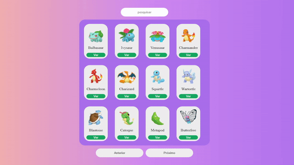

<h1 align="center">
  POKE_SEARCH
</h1>

  <a href="#-tecnologias">Tecnologias</a>&nbsp;&nbsp;&nbsp;|&nbsp;&nbsp;&nbsp;
  <a href="#-projeto">Projeto</a>&nbsp;&nbsp;&nbsp;|&nbsp;&nbsp;&nbsp;
  <a href="#-layout">Layout</a>&nbsp;&nbsp;&nbsp;|&nbsp;&nbsp;&nbsp;
  <a href="#-como-executar">Como executar</a>&nbsp;&nbsp;&nbsp;|&nbsp;&nbsp;&nbsp;
  <a href="#-executando-a-aplicação">Executando a aplicação</a>

## 🚀 Tecnologias

Esse projeto foi desenvolvido com as seguintes tecnologias:

- [React](https://reactjs.org)    
  
- [TypeScript](https://www.javascript.com/)    

## 💻 Projeto

O Poke Search é uma aplicação que permite que você pesquise e visualize informações sobre todos os Pokemons existentes.

## ✨ Layout

  

## 🔖 Como executar

- Clone o repositório
- Instale as dependências com `npm`
- Inicie o servidor com `npm run dev`

Agora você pode acessar [`localhost:3001`](http://localhost:3001) do seu navegador.

## 🎬 Executando a aplicação

  

